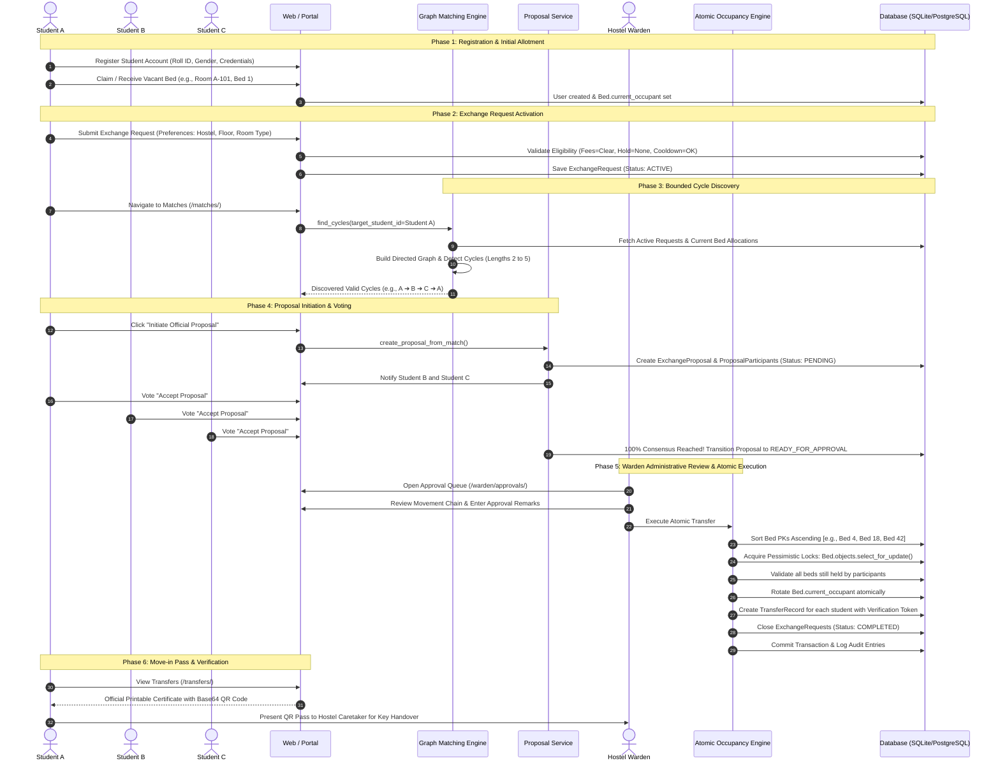
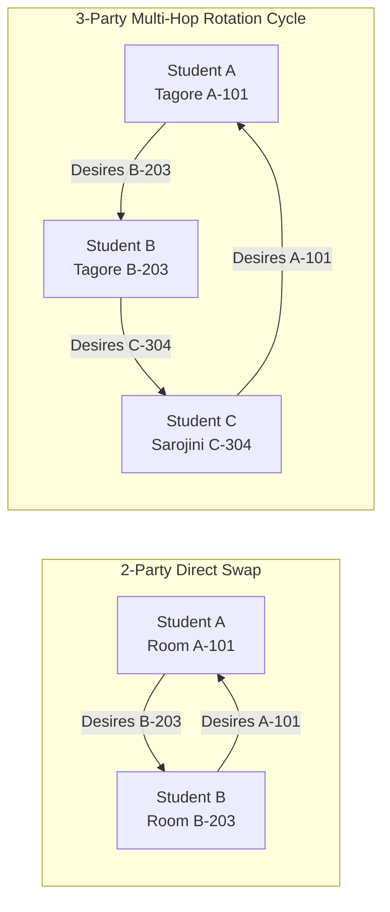
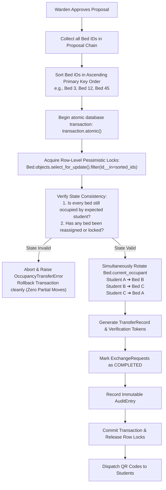
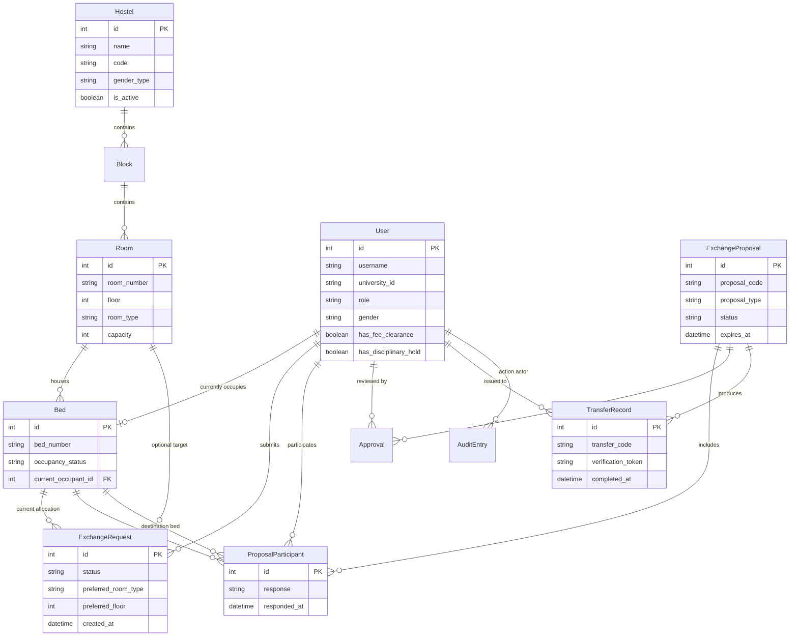

# System Architecture & Complete Workflow Guide

**Project:** CampusExchange (EduRev Hostel Room Exchange Platform)  
**Framework:** Django 5.x / Python / SQLite (ACID)  
**Graph Engine:** NetworkX Directed Graph Cycle Detection  
**Security & Concurrency:** Pessimistic Row-Level Locking (`select_for_update`) with Deterministic PK Ordering  

---

## Table of Contents
1. [High-Level System Architecture](#1-high-level-system-architecture)
2. [End-to-End Operational Lifecycle Workflow](#2-end-to-end-operational-lifecycle-workflow)
3. [Graph Matching Engine Architecture](#3-graph-matching-engine-architecture)
4. [Atomic Concurrency & Two-Phase Locking Strategy](#4-atomic-concurrency--two-phase-locking-strategy)
5. [Entity Relationship Diagram (ERD)](#5-entity-relationship-diagram-erd)
6. [Role-Based Access Control (RBAC) Matrix](#6-role-based-access-control-rbac-matrix)

---

## 1. High-Level System Architecture

The application follows a clean 4-tier layered architecture enforcing clear separation of concerns, transactional integrity, and policy compliance.

```mermaid
flowchart TB
    subgraph Client_Layer["🖥️ Presentation & Client Tier"]
        UI_Guest["Public Pages<br/>(Landing, Sign In, Registration)"]
        UI_Student["Student Cockpit<br/>(Room Visualizer, Match Finder, Proposals)"]
        UI_Warden["Warden Console<br/>(Consensus Queue, Review & Execute)"]
        UI_Admin["DSW / Admin Dashboard<br/>(Analytics, Policies, Audit Logs)"]
    end

    subgraph Security_Layer["🛡️ Security & Access Control Tier"]
        AuthMiddleware["Django Authentication"]
        RBAC["RBAC Middleware<br/>(Role-Based Route Guards)"]
        ContextProc["RBAC Context Processor<br/>(Dynamic UI Roles & Bed Data)"]
    end

    subgraph Engine_Layer["⚙️ Core Business Logic & Engines Tier"]
        EligibilitySvc["Eligibility Service<br/>(Fee Clearance, Disciplinary Checks, Cooling-off)"]
        MatchingEngine["Graph Matching Engine<br/>(NetworkX DiGraph, 2 to 5 Cycle Finder)"]
        ProposalSvc["Proposal Management Service<br/>(Consensus Tracker, Expiry Countdown)"]
        OccupancyEngine["Atomic Occupancy Engine<br/>(Ascending PK Row Locks, Multi-Bed Swap)"]
        AuditSvc["Audit Service<br/>(Append-Only Immutable Event Logging)"]
        QRGenerator["Cryptographic QR Engine<br/>(Base64 Security Token & Pass Generation)"]
    end

    subgraph Database_Layer["💾 Relational Persistence Tier (ACID)"]
        DB_Users[("User Accounts & Roles")]
        DB_Hostel[("Hostels, Blocks, Rooms, Beds")]
        DB_Exchange[("Requests, Proposals, Participants")]
        DB_Transfers[("Transfer Records & QR Tokens")]
        DB_Audit[("Audit Log Entries")]
    end

    Client_Layer --> Security_Layer
    Security_Layer --> Engine_Layer
    Engine_Layer --> Database_Layer
```

---

## 2. End-to-End Operational Lifecycle Workflow

The entire lifecycle of a room exchange—from student registration through to warden sign-off and move-in pass generation:

---

## 3. Graph Matching Engine Architecture

The platform uses a directed dependency graph model where students with active requests represent nodes, and directed edges represent desirable room matches.

### Edge Compatibility Scoring Algorithm
When evaluating if an edge exists from Student $A$ to Student $B$:
1. **Gender Residency Policy**: Strict separation (Boys hostel $\leftrightarrow$ Girls hostel blocked unless policy permits).
2. **Target Matching Criteria**:
   - Specific Room Request: $+50$ points (Exact match)
   - Preferred Hostel: $+25$ points
   - Preferred Room Type (Single / Double / Quad): $+15$ points
   - Preferred Floor: $+10$ points
3. **Cycle Filtering & Deduplication**:
   - Maximum Chain Length: Bounded between $2$ and $5$ students (configured in `PolicyRule`).
   - Rotational Invariance: `[A, B, C]` and `[B, C, A]` are normalized to minimal student ID to avoid duplicate proposals.

---

## 4. Atomic Concurrency & Two-Phase Locking Strategy

To prevent race conditions, double-allocations, and **ABBA Deadlocks** when multiple proposals share overlapping beds:

> **Deadlock Prevention Proof**: Because all concurrent warden transactions acquire row locks in the exact same sorted order (`Bed 3 -> Bed 12 -> Bed 45`), a circular wait state is mathematically impossible.

---

## 5. Entity Relationship Diagram (ERD)

---

## 6. Role-Based Access Control (RBAC) Matrix

| Endpoint / Feature | Student | Hostel Warden | Chief Warden | Admin | Dean of Student Welfare (DSW) |
| :--- | :---: | :---: | :---: | :---: | :---: |
| **Landing Page & System Stats** | ✅ View | ✅ View | ✅ View | ✅ View | ✅ View |
| **Student Cockpit & 2D Room Cutaway** | ✅ Own Room | ❌ | ❌ | ❌ | ❌ |
| **Submit Exchange Request** | ✅ Own | ❌ | ❌ | ❌ | ❌ |
| **View Graph Matches** | ✅ Own Matches | ❌ | ❌ | ❌ | ❌ |
| **Vote on Proposal (Accept/Decline)** | ✅ Participant | ❌ | ❌ | ❌ | ❌ |
| **Warden Approval Queue** | ❌ | ✅ Hostel | ✅ All Hostels | ✅ All | ❌ (Read Only) |
| **Execute Atomic Transfer** | ❌ | ✅ Intra-Hostel | ✅ Cross-Hostel | ✅ Override | ❌ |
| **Download Official Pass & QR Code** | ✅ Own Pass | ✅ Verify | ✅ Verify | ✅ Verify | ✅ Verify |
| **DSW Analytics & Real-Time Trends** | ❌ | ❌ | ❌ | ✅ Full | ✅ Full Read |
| **Policy Configuration (Cooldown, Length)**| ❌ | ❌ | ❌ | ✅ Configure | ❌ |
| **Audit Trail Inspection** | ❌ | ❌ | ❌ | ✅ Full Log | ✅ Full Log |
